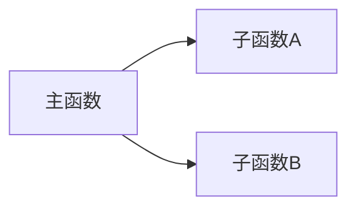

# C 函数详细设计文档生成器

## 使用场景

- 需要为 C 项目中的所有函数生成详细设计文档
- 需要按照指定的 docx 模板格式输出
- 项目中有 Source.md 或类似的函数算法描述文件
- 函数数量多，需要长时间批量处理

## 输出文档模板格式

生成的文档必须严格遵循以下层级结构：

```
3. 软件单元设计
  3.1. <模块名>
    文件-函数对照表（表格）

4. 详细设计描述
  4.1. <函数名A>()
    4.1.1. 单元描述
    4.1.2. 单元调用关系
    4.1.3. 接口信号
  4.2. <主函数B>()
    4.2.1. 单元描述
    4.2.2. 单元调用关系
    4.2.3. 接口信号
    4.2.4. <子函数C>()          ← 被主函数调用的子函数嵌套在下面
      4.2.4.1. 单元描述
      4.2.4.2. 单元调用关系
      4.2.4.3. 接口信号
```

### 单元描述格式

用带编号的步骤描述算法流程，使用圆圈编号 ①②③...：

```
<函数名>()在<调用时机>被调用，是<模块>的<功能描述>。主要功能包括<概述>。

①  <步骤1描述>；
②  <步骤2描述>；
③  判断条件：
    - 若<条件A>，则<操作A>；
    - 否则，<操作B>；
```

### 单元调用关系格式

使用 mermaid 图：



如果函数不调用其他函数，只写函数名本身。

### 接口信号表格式

必须使用以下列头（与模板一致）：

```
| 输入/输出 | 接口 | 相关组件 | 接口描述 | 数据类型 | 范围 | 单位 |
```

字段映射规则（从 Source.md 参数表转换）：
- "方向" → "输入/输出"
- "变量名" → "接口"
- "所在函数名" → "相关组件"
- "变量描述" → "接口描述"
- "数据类型" → "数据类型"
- "取值范围" → "范围"
- "单位" → "单位"

内部变量的"输入/输出"列填写"内部"。
标定量/宏常量的"输入/输出"列填写"标定量"。

### 颜色编码

在 markdown 中使用 HTML span 标签：
- 全局变量/参数：`<span style="color:blue">变量名</span>`
- 标定量：`<span style="color:purple">***标定量名***</span>`
- 状态机/枚举：`<span style="color:red">*状态名*</span>`

## 工作流程

### 阶段一：扫描与索引

1. 使用 `Glob` 查找目标目录下所有 `.c` 文件
2. 使用 `Read` 读取每个 .c 文件，提取函数定义（函数名、参数列表、函数体）
3. 如果存在 `Source.md`，读取并按函数名建立索引：
   - 函数名 → 单元描述文本
   - 函数名 → 参数说明表
   - 函数名 → 调用关系 mermaid 图
4. 如果存在模板文件（docx），用 `textutil` 转换为文本参考格式
5. 生成 `progress.json` 记录任务清单：

```json
{
  "total_files": 13,
  "total_functions": 12,
  "completed": [],
  "pending": ["DampgTrqSum", "JCmp", "QuadBlendIntrpn", ...],
  "output_file": "DetailedDesign.md"
}
```

### 阶段二：逐函数生成（长任务核心）

**关键策略：每完成一个函数就写入输出文件并更新进度。**

对 `progress.json` 中每个 pending 函数：

1. 从 Source.md 索引中获取该函数的：
   - 单元描述（算法流程）
   - 参数说明表
   - 调用关系图
2. 从 .c 源码中获取该函数的：
   - 完整函数体（用于补充/验证描述）
   - 实际参数类型
3. 按模板格式生成该函数的三个子章节：
   - `N.M.1. 单元描述` — 保持 Source.md 中的编号步骤格式
   - `N.M.2. 单元调用关系` — 使用 mermaid 图
   - `N.M.3. 接口信号` — 转换参数表为模板列头格式
4. **追加写入** `DetailedDesign.md`
5. **更新** `progress.json`：将该函数从 pending 移到 completed

**中断恢复**：如果检测到 `progress.json` 已存在且有 completed 记录，跳过已完成的函数，从第一个 pending 函数继续。

### 阶段三：汇总

1. 在 `DetailedDesign.md` 头部插入：
   - 文档标题
   - "3. 软件单元设计" 章节（文件-函数对照表）
   - "4. 详细设计描述" 章节标题
2. 报告统计信息：
   - 处理的 .c 文件数量
   - 生成的函数设计数量
   - 输出文件路径

## 执行步骤（给 AI Agent 的指令）

当用户触发此技能时，严格按以下步骤执行：

### 步骤 1：确定输入

```
必须确认以下信息（询问用户或自动检测）：
- source_dir: .c 文件所在目录（如 ./Source/）
- source_md: 函数描述文件路径（如 ./Source.md）
- template: 模板文件路径（如 ./输出文档期望的模板/xxx.docx，可选）
- output: 输出文件路径（默认 ./DetailedDesign.md）
- module_name: 模块名称（用于文档标题，如 "Damping"）
```

### 步骤 2：扫描 .c 文件

```bash
# 使用 Glob 查找
pattern: "<source_dir>/**/*.c"
```

对每个 .c 文件，使用 Grep 提取函数定义：
```
pattern: "^[a-zA-Z_][a-zA-Z0-9_*\\s]+\\s+[a-zA-Z_][a-zA-Z0-9_]*\\s*\\("
```

### 步骤 3：解析 Source.md

读取 Source.md，按 `## 函数签名` 或函数名分割，建立索引。
Source.md 中每个函数通常包含：
- `## 函数签名` — 函数名
- `## 单元描述` — 算法流程
- `## 参数说明` — 参数表（markdown 表格）
- `## 单元调用关系` — mermaid 图
- `## 返回值` — 返回类型

### 步骤 4：检查恢复点

```python
if os.path.exists("progress.json"):
    # 读取进度，跳过已完成的函数
    # 从第一个 pending 函数继续
else:
    # 创建新的 progress.json
```

### 步骤 5：逐函数生成

对每个待处理函数，生成以下 markdown 内容并追加到输出文件：

```markdown
### 4.<N>. <函数名>()

#### 4.<N>.1. 单元描述

<从 Source.md 提取的算法流程，保持编号步骤>

#### 4.<N>.2. 单元调用关系

<mermaid 调用图>

#### 4.<N>.3. 接口信号

| 输入/输出 | 接口 | 相关组件 | 接口描述 | 数据类型 | 范围 | 单位 |
| :--- | :--- | :--- | :--- | :--- | :--- | :--- |
| 输入 | <变量名> | <函数名> | <描述> | <类型> | <范围> | <单位> |
| 输出 | <变量名> | <函数名> | <描述> | <类型> | <范围> | <单位> |
| 内部 | <变量名> | <函数名> | <描述> | <类型> | <范围> | <单位> |
```

**每完成一个函数后立即**：
1. 将内容追加写入输出文件
2. 更新 progress.json

### 步骤 6：生成文档头部

所有函数处理完成后，在文档最前面插入：

```markdown
# <模块名>
## Detailed Software Design Document

## 3. 软件单元设计

### 3.1. <模块名>

| 文件 | 函数 |
| :--- | :--- |
| <文件名>.c | <函数A>() |
|            | └─ <子函数B>() |
|            | └─ <子函数C>() |

## 4. 详细设计描述

本章节使用以下颜色编码区分不同类型的变量和参数：

| 颜色标识 | 类型 | 示例 |
| :--- | :--- | :--- |
| <span style="color:blue">蓝色</span> | 全局变量 / 参数 | <span style="color:blue">var_xxx.Speed</span> |
| <span style="color:purple">紫色</span> | 标定量 | <span style="color:purple">***VEH_SPD_FLT_TIME_CONST***</span> |
| <span style="color:red">红色</span> | 状态机 | <span style="color:red">*UNAVAILABLE*</span> |
```

### 步骤 7：报告结果

```
✓ 详细设计文档生成完成！

统计信息：
- 扫描的 .c 文件：<N> 个
- 生成的函数设计：<M> 个
- 输出文件：<output_path>

如需转换为 docx 格式，可使用 pandoc：
  pandoc DetailedDesign.md -o DetailedDesign.docx
```

## 工具使用

### 必需工具
- `Glob`：查找 .c 文件
- `Read`：读取 .c 文件和 Source.md
- `Grep`：提取函数定义
- `Write`：写入输出文件和 progress.json
- `Bash`：执行 Python 脚本（可选，用于批量提取）

### 可选工具
- `Bash` + `textutil`：将 docx 模板转为文本参考
- `Bash` + `pandoc`：将输出 markdown 转为 docx

## 长任务执行策略

### 检查点机制

每完成一个函数的文档生成后：
1. 追加写入输出文件（不是覆盖，是追加）
2. 更新 progress.json 中的 completed/pending 列表
3. 这样即使会话中断，下次可以从断点恢复

### 中断恢复

当检测到 progress.json 存在时：
1. 读取已完成列表
2. 读取已生成的输出文件内容
3. 从第一个 pending 函数继续生成
4. 追加到已有输出文件末尾

### 大文件处理

如果 .c 文件超过 500 行：
- 只提取目标函数的函数体（从函数签名到对应的闭合大括号）
- 不要一次性读取整个文件到上下文

### 进度报告

每处理完 3 个函数，输出一次进度：
```
[进度] 已完成 6/12 个函数 (50%)
```

## 注意事项

1. **编号一致性**：文档中的章节编号必须连续且与函数顺序一致
2. **子函数嵌套**：如果函数 A 调用了函数 B，且 B 也在同一模块中，B 应嵌套在 A 的章节下
3. **Source.md 优先**：如果 Source.md 中有函数描述，优先使用；如果没有，从 .c 源码分析生成
4. **表格对齐**：接口信号表必须使用左对齐 `:---`
5. **mermaid 语法**：调用关系图使用 `graph LR`（从左到右）
6. **不要遗漏函数**：即使是辅助函数（如查表插值函数 TabIdx...、Tab1DIntp...）也要生成文档
